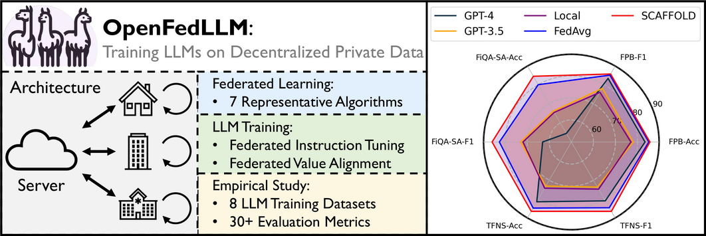

# sLLM Federated Learning Framework _Capstone Project

# Project Information

This project is focused on developing a framework for federated learning for small LLMs (sLLM), integrating OpenFed and Prometheus-7b. By leveraging the capabilities of OpenFed for distributed training and Prometheus-7b as the core language model, we aim to create an efficient, privacy-preserving, and collaborative learning environment suitable for IoT edge devices and other small-scale applications.

## Framework Overview

The sLLM Federated Learning Framework is designed to support the training of small LLMs across multiple devices in a distributed fashion without the need to share raw data. OpenFed handles the federated learning orchestration, ensuring that training is decentralized and data privacy is maintained. Prometheus-7b is used as the base model, providing the language processing capabilities required for various applications.

# Team Members

- **컴퓨터공학과 19011581**: 이정우 
- **컴퓨터공학과 20011681**: 서민석 
- **데이터사이언스학과 21011812**: 김지수
- **데이터사이언스학과 21011815**: 이종호 

# Development Languages and Tools
- Python
- OpenFed
- Prometheus-7b
- FlASK ( FOR EVALUATION )

## What is the sLLM Federated Learning Framework?

Federated learning allows models to be trained across multiple devices or servers holding local data samples without exchanging them, thus ensuring data privacy. This project integrates OpenFed, a federated learning orchestration tool, with Prometheus-7b, a small language model, to create a collaborative learning environment. This framework is particularly suitable for IoT edge devices where computational resources are limited, and data privacy is crucial.

The framework allows users to train models collaboratively, utilizing local data on each device while updating a shared global model. By using Prometheus-7b, the system can efficiently perform language-related tasks such as data analysis and knowledge sharing among devices, which is ideal for intelligent IoT edge applications.

## Start Guide

## Requirements

- **Federated Learning Setup**: Devices need to support federated learning using OpenFed, which allows distributed training while maintaining data privacy.
- **Model Training**: Prometheus-7b is used as the base model for training, and users can contribute to the global model using their local datasets.
- **Framework Integration**: The framework is designed to integrate with various IoT devices and edge environments, making it adaptable for a range of applications.

----------

### License

Apache License, Version 2.0

